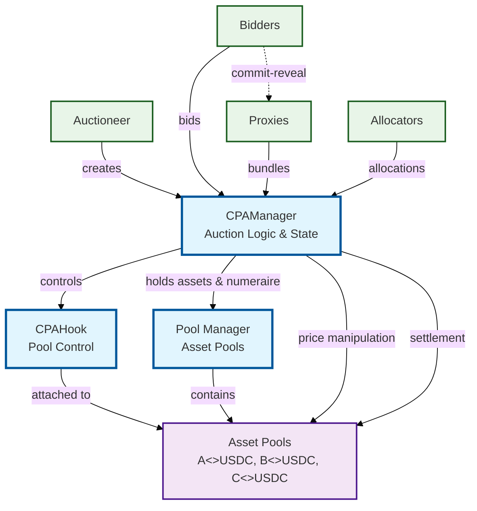

# Rok Protocol Architecture Diagram

## Key Relationships

### Core Architecture
- **CPAManager** manages auction logic and state across multiple concurrent auctions
- **CPAHook** controls asset pools during auctions, blocking normal trading
- **Pool Manager** contains the asset pools that facilitate price discovery and settlement
- Single CPAHook serves all asset pools for efficiency

### Participant Roles
- **Auctioneer**: Creates and configures auctions
- **Bidders**: Participate in price discovery through iterative bidding
- **Proxies**: Submit bundles on behalf of bidders using commit-reveal privacy
- **Allocators**: Compete to find optimal allocations and earn rewards

### Auction Flow
1. **Clock Phase**: Price discovery through iterative bidding
2. **Proxy Phase**: Bundle submission with privacy-preserving commit-reveal
3. **Allocation Phase**: Competitive allocation determination
4. **Settlement Phase**: Token distribution and claiming

### Key Features
- **Privacy-Preserving**: Commit-reveal system maintains bidder-proxy anonymity
- **Multi-Asset**: Support for auctions across multiple token pairs
- **Competitive Allocation**: Allocator competition with on-chain rewards
- **Uniswap V4 Integration**: Built using V4 hooks for pool control
